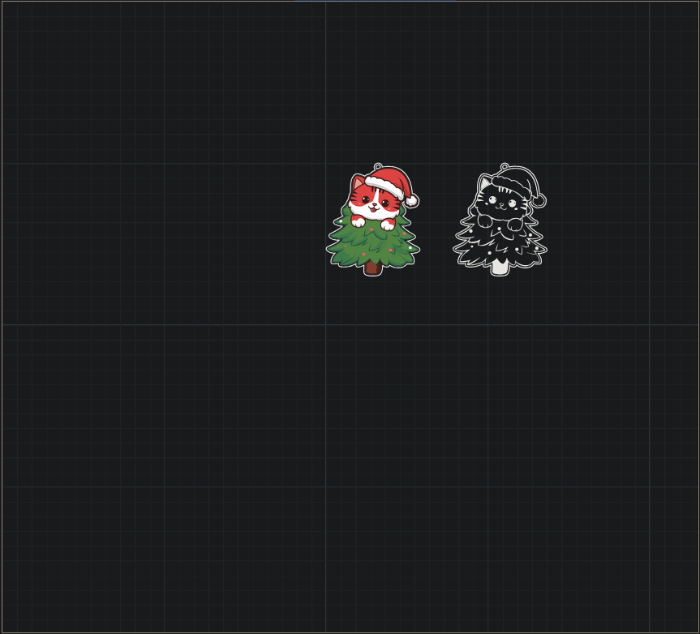

# XCStoSVG (prod)

Convertisseur de fichiers XCS (XTool Creative Space) vers SVG — version prête à être déployée via Docker.

— English version below —

## 🇫🇷 Présentation

Ce dépôt contient la version "production" du convertisseur XCS → SVG. L’application est packagée avec Vite (build statique) et servie par Nginx dans un conteneur Docker.

### Fonctionnalités
- Import d’un fichier `.xcs` et conversion en un SVG
- Téléchargement individuel
- Interface basée sur UI5 Web Components

## 🚀 Démarrage rapide (Docker)

Construire l’image:

```bash
docker build -t xcstosvg-prod .
```

Lancer (exposé sur le port 8082):

```bash
docker run --rm -p 8082:80 xcstosvg-prod
```

Ouvrir: `http://localhost:8082/`

Notes:
- Le `base` Vite est configuré sur `/`.
- Le build est statique, servi par Nginx.

## ▶️ Utilisation sans Docker (npm)

Prérequis: Node 18+ et npm.

Installer les dépendances:

```bash
npm install
```

Serveur de développement (Vite):

```bash
npm run dev
```

Build de production:

```bash
npm run build
```

Aperçu local du build:

```bash
npm run preview
```

Notes:
- Le `base` Vite est `/`, l’application est servie à la racine pendant `preview`.

## 🔒 Sécurité (état actuel)
Cette version vise la facilité de déploiement. Des en-têtes de sécurité renforcés (CSP, etc.) peuvent être ajoutés ultérieurement dans `nginx.conf` si nécessaire.

## 🤖 À propos de l’IA
Ce projet a été structuré et une partie du code a été générée/assistée par une IA. Merci de prendre cela en compte lors des revues et contributions.

## 📷 Comparaison visuelle (information uniquement)
Comparaison neutre, à titre informatif uniquement (aucun dénigrement de l’outil de Nanovsky).

| Outil de Nanovsky | Cette implémentation |
| --- | --- |
| [](resources/compare-nanovsky.png) | [](resources/compare-me.png) |

## 🇬🇧 Overview

Production-ready XCS (XTool Creative Space) to SVG converter. The app is built with Vite (static output) and served by Nginx inside a Docker container.

### Features
- Import `.xcs` and convert to one SVG
- Download single SVG
- UI built with UI5 Web Components

## 🚀 Quick start (Docker)

Build the image:

```bash
docker build -t xcstosvg-prod .
```

Run (exposed on port 8082):

```bash
docker run --rm -p 8082:80 xcstosvg-prod
```

Open: `http://localhost:8082/`

Notes:
- Vite `base` is set to `/`.
- Static build served by Nginx.

## ▶️ Run without Docker (npm)

Requirements: Node 18+ and npm.

Install dependencies:

```bash
npm install
```

Dev server (Vite):

```bash
npm run dev
```

Production build:

```bash
npm run build
```

Preview the built app:

```bash
npm run preview
```

Notes:
- Vite `base` is `/`, so the app is served at root during `preview`.

## 🔒 Security (current state)
This release prioritizes ease of deployment. Stronger security headers (CSP, etc.) can be enabled later in `nginx.conf` if needed.

## 📷 Visual comparison (for information only)
Neutral comparison for information only (no disparagement of Nanovsky’s work).

| Nanovsky’s tool | This implementation |
| --- | --- |
| [](resources/compare-nanovsky.png) | [](resources/compare-me.png) |


## 🤖 About AI Assistance
This repository was set up and partially implemented with the help of an AI assistant. Please keep this in mind when reviewing and contributing.

