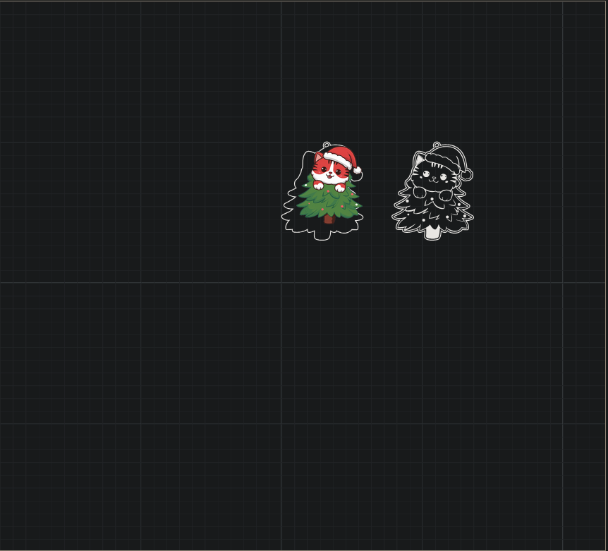

# XCStoSVG (prod)

Convertisseur de fichiers XCS (XTool Creative Space) vers SVG — version prête à être déployée via Docker.

— English version below —

## 🇫🇷 Présentation

Ce dépôt contient la version "production" du convertisseur XCS → SVG. L’application est packagée avec Vite (build statique) et servie par Nginx dans un conteneur Docker.

### Fonctionnalités
- Import d’un fichier `.xcs` et conversion en un ou plusieurs SVG
- Téléchargement individuel ou au format `.zip`
- Interface basée sur UI5 Web Components

## 🚀 Démarrage rapide (Docker)

Construire l’image:

```bash
docker build -t xcstosvg-prod .
```

Lancer (exposé sur le port 8082):

```bash
docker run --rm -p 8082:80 xcstosvg-prod
```

Ouvrir: `http://localhost:8082/XCStoSVG-prod/`

Notes:
- Le `base` Vite est configuré sur `/XCStoSVG-prod/`.
- Le build est statique, servi par Nginx.

## 🔒 Sécurité (état actuel)
Cette version vise la facilité de déploiement. Des en-têtes de sécurité renforcés (CSP, etc.) peuvent être ajoutés ultérieurement dans `nginx.conf` si nécessaire.

## 🤖 À propos de l’IA
Ce projet a été structuré et une partie du code a été générée/assistée par une IA. Merci de prendre cela en compte lors des revues et contributions.

## 📷 Comparaison visuelle (information uniquement)
La première image ci‑dessous montre un résultat obtenu avec l’outil de Nanovsky, la seconde montre le résultat de cette implémentation. Cette comparaison est fournie à titre informatif uniquement, sans intention de dénigrer l’outil de Nanovsky.




Placez vos captures dans `resources/compare-nanovsky.png` et `resources/compare-ours.png` pour qu’elles s’affichent dans ce README.

## 📄 Licence
MIT — voir le fichier `LICENSE`.

---

## 🇬🇧 Overview

Production-ready XCS (XTool Creative Space) to SVG converter. The app is built with Vite (static output) and served by Nginx inside a Docker container.

### Features
- Import `.xcs` and convert to one or multiple SVGs
- Download single SVGs or a `.zip`
- UI built with UI5 Web Components

## 🚀 Quick start (Docker)

Build the image:

```bash
docker build -t xcstosvg-prod .
```

Run (exposed on port 8082):

```bash
docker run --rm -p 8082:80 xcstosvg-prod
```

Open: `http://localhost:8082/XCStoSVG-prod/`

Notes:
- Vite `base` is set to `/XCStoSVG-prod/`.
- Static build served by Nginx.

## 🔒 Security (current state)
This release prioritizes ease of deployment. Stronger security headers (CSP, etc.) can be enabled later in `nginx.conf` if needed.

## 📷 Visual comparison (for information only)
The first screenshot below shows a result from Nanovsky’s tool; the second shows this implementation’s result. This is meant for neutral comparison only, not to disparage Nanovsky’s work.


Put your screenshots at `resources/compare-nanovsky.png` and `resources/compare-me.png` so they display here.

## 🤖 About AI Assistance
This repository was set up and partially implemented with the help of an AI assistant. Please keep this in mind when reviewing and contributing.

## 📄 License
MIT — see `LICENSE`.
